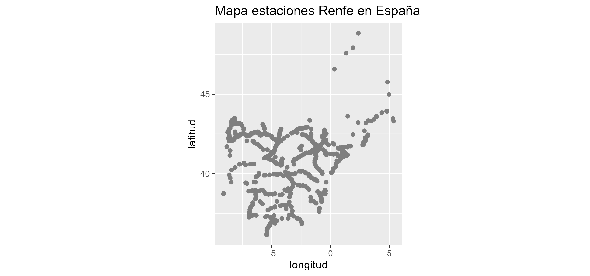
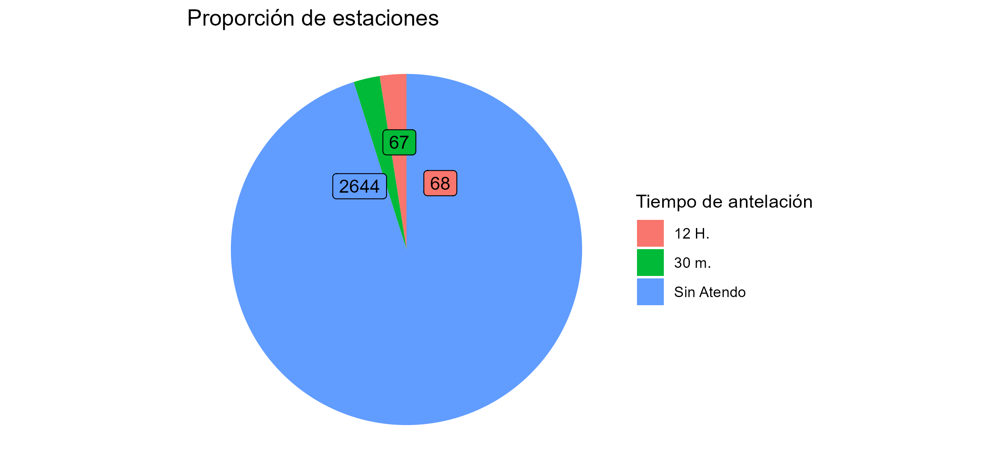
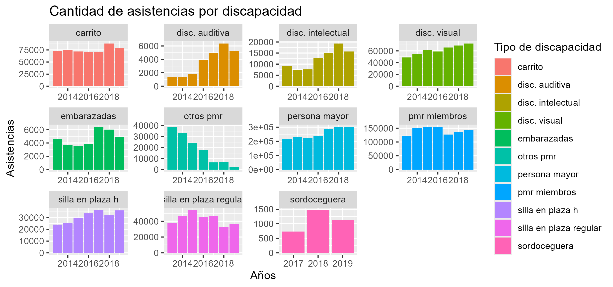
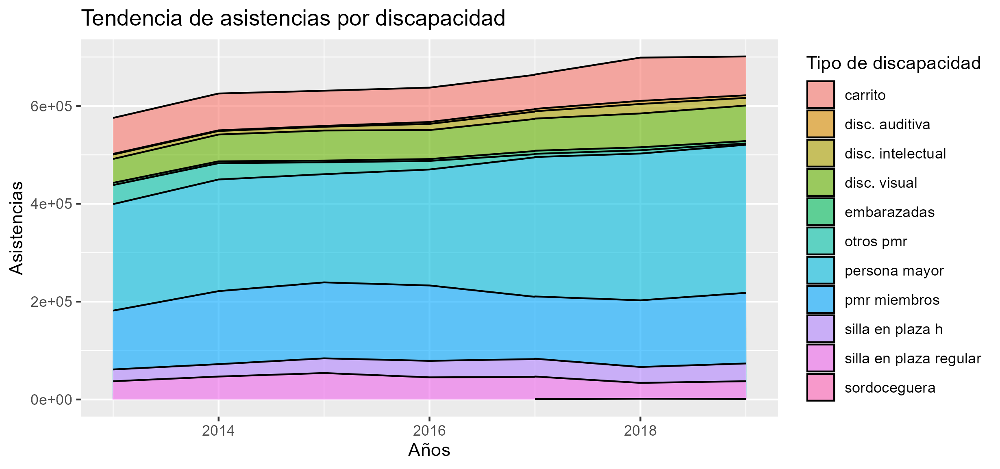

# Introducción

Este programa es el proyecto final del curso: Google Data Analytics Professional Certificate.
Durante el desarrollo del curso, se ha explorado el paso a paso del análisis de datos.
Para aplicar todo lo aprendido, se seguirán los siguientes pasos para este proyecto:

1. Preguntar
2. Preparar
3. Procesar
4. Analizar
5. Compartir
6. Actuar

La temática para este proyecto será del servicio Atendo de Renfe.

# 1. Preguntar

Renfe (Red Nacional de Ferrocarriles Españoles) ofrece servicios de desplazamiento sobre raíles. Uno de sus servicios es Atendo. En este apartado, se responderán las siguientes preguntas:

- ¿Qué es Atendo?
- ¿Qué datos se emplearán?
- ¿Qué preguntas se buscan responder con el análisis?

## 1.1. ¿Qué es Atendo?

Atendo es un servicio gratuito de atención y asistencia a personas con discapacidad o movilidad reducida.
Los servicios ofrecidos son los siguientes:

- Si vas en silla de ruedas y quieres viajar en tu asiento, tu silla de ruedas deberá ser pleglable; sin embargo, podrá viajar sin problema.
- Si tienes otras dificultades de movilidad, puedes solicitar una silla de ruedas para desplazarte por la estación y recibir asistencia para subir y bajar del tren.
- Si tienes una discapacidad auditiva, dispones de apoyos técnicos para una mejor comunicación.
- Si tienes una discapacidad visual, tendrás acompañamiento en tu desplazamiento por la estación y asistencia para subir y bajar del tren, así como para encontrar tu asiento.
- Si tienes una discapacidad intelectual o dificultades de comprensión, recibirás orientación y acompañamiento hasta tu sitio en el tren.

Estos servicios se ofrecen en estaciones con servicio permanente o puntual.

## 1.2. ¿Qué datos se emplearán?

Todos los datos tratados serán obtenidos en las siguientes páginas de Renfe:

- [Qué es atendo.](renfe.com/viajar/informacion-util/servicio-de-asistencia/que-es)
- [Dataset de Renfe.](data.renfe.com/dataset)

## 1.3. ¿Qué preguntas se buscan responder con el análisis?

- ¿Cuánta gente usa este servicio?
- ¿La gente está satisfecha?
- ¿Qué carencias hay?
- ¿Hay suficientes datos?

# 2. Preparar

En la página de Renfe data hay 66 conjuntos de datos disponibles.
De estos datos, se comenzarán usando los siguientes:

- Distribución de las asistencias por tipo de discapacidad.
- Estaciones.
- Indicadores de calidad del servicio público.
- Indicadores de calidad de servicios comerciales.
- Estaciones AVE, larga distancia y media distancia.
- Estaciones con servicio Atendo.
- Número de asistencias del servicio Atendo.
- Número de empleados.
- Indicadores económicos.
- Indicadores sociales.

Estos datos están distribuidos en tablas con datos que comprenden el periodo entre 2013 y 2019. Si bien no son datos actualizados, serán de ayuda para empezar a ver una tendencia.

# 3. Procesar

Para analizar los datos, primero hay que limpiarlos. Para ello, se emplearán las siguientes librerías:

 - Tidyverse.
 - Janitor.
 
Los pasos a seguir serán los siguientes:
 
 1. Importar las tablas en formato .csv en dataframes.
 2. Unificar el formato de los campos de manera masiva.
 3. Corregir manualmente los campos específicos necesarios.
 
En este caso, además se han unido todas las tablas con datos anuales en una sola. Esto facilitará su posterior análisis.

# 4. Analizar

En el proceso de análisis se realizarán una serie de gráficos. Para facilitar dicha tarea, se generarán unas tablas con los datos a emplear. Dichas tablas tendrán el siguiente formato:

## datos_atendo_elegidos

```{r datos atendo elegidos, echo=FALSE}
datos_atendo_elegidos <- read.csv("datos_atendo_elegidos.csv")
head(datos_atendo_elegidos)
```

## datos_anuales_elegidos

```{r datos anuales elegidos, echo=FALSE}
datos_anuales_elegidos <- read.csv("datos_anuales_elegidos.csv")
head(datos_anuales_elegidos)
```

Con estos datos, se sacaron los siguientes gráficos:









# 5. Compartir

A partir de los gráficos obtenidos, se pueden sacar distintas conclusiones. Estas conclusiones se presentarán en el formato más adecuado a las partes interesadas. En este caso se responderá a las preguntas realizadas en el primer punto:

## ¿Cuánta gente usa este servicio?

Para responder a esta pregunta, hay que dejar clara la diferencia entre personas y viajeros.

Las personas son los usuarios individuales de los servicios de Renfe, mientras que los viajeros son las personas asistentes en casa viaje. Esto quiere decir que una persona puede ser viajero varias veces.

Por lo que el número de viajeros que han empleado este servicio, si bien ha tenido una tendencia de ascenso, siguen siendo decenas de miles anuales.

## ¿La gente está satisfecha?

Esta pregunta es dificil de responder, ya que los datos disponibles no tienen una métrica fiable. Siendo esto cierto, los datos no han variado significativamente en el tramo observado.

## ¿Qué carencias hay?

Debido al porcentaje de asistencias a población de la tercera edad, sería conveniente comprobar el nivel de conocimiento del servicio por parte del resto de usuarios potenciales.

## ¿Hay suficientes datos?

En cuanto a la cantidad, los datos disponibles permiten ver una tendencia de la evolución del servicio. No obstante, la situación puede variar actualmente debido a la pandemia de covid-19 que hubo a nivel mundial.

En cuanto a la calidad, se debería cuidar más la presentación de los datos por parte de la fuente. La mayor carencia en este aspecto es la incomprensión parcial de las tablas de indicadores de calidad.


# 6. Actuar

Los datos analizados son insuficientes para tomar decisiones correctamente fundadas; sin embargo, se podría ampliar esta información recopilando datos cualitativos y específicos del servicio Atendo.

También cabe destacar la importancia de facilitar la solicitud de este servicio, a través de carteles informativos al lado de las taquillas, por ejemplo.
